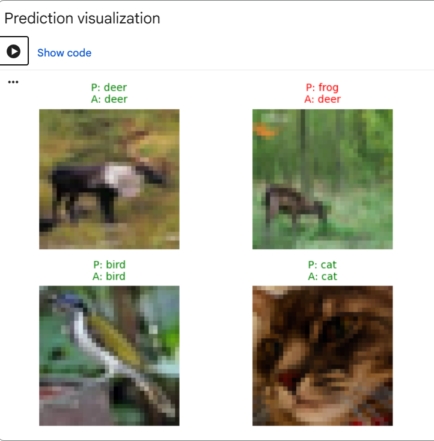
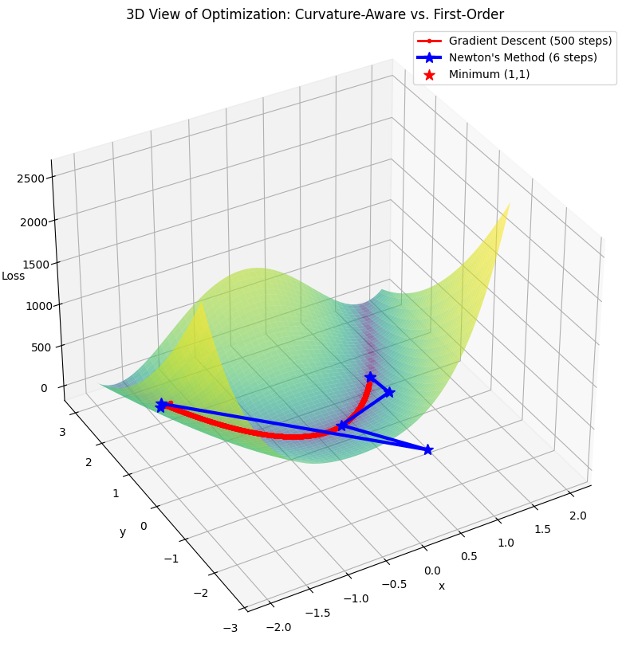

## JAX experiments
<table>
  <thead>
    <tr>
      <th width="40%"></th>
      <th width="60%">Notebook</th>
    </tr>
  </thead>
  
  <tr>
    <td align="center">
      
    </td>
    <td valign="top">
      <h3><a href="notebooks/01_distributed_cnn.ipynb">1. Distributed CIFAR-10 training in JAX and Flax</a></h3>
      
Training a simple classifier, with JIT and PMAP for SPMD.

      

<a href="notebooks/01_distributed_cnn.ipynb">Notebook</a>

      </td>
  </tr>

  <tr>
    <td align="center">
      
    </td>
    <td valign="top">
      <h3><a href="notebooks/02_curvature_and_newton_methods.ipynb">2. Newton's method via AutoDiff</a></h3>
      
Using JAX's AutoDiff twice for Newton's method.

      
<a href="notebooks/02_curvature_and_newton_methods.ipynb">Notebook</a>

    </td>
  </tr>

  <tr>
    <td align="center">
      
    </td>
    <td valign="top">
      <h3><a href="03_Simple_QAT_in_JAX.ipynb">3. QAT vs PTQ in JAX</a></h3>
      
Implementation of QAT and PTQ in JAX and perf comparison.

      
<a href="notebooks/03_Simple_QAT_in_JAX.ipynb">Notebook</a>

    </td>
  </tr>
</table>
